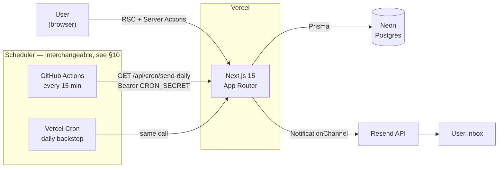
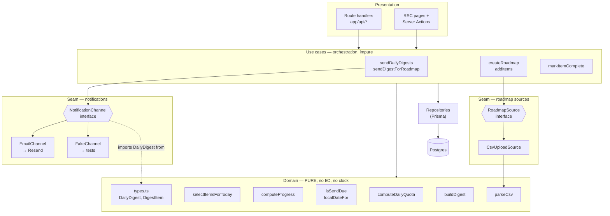
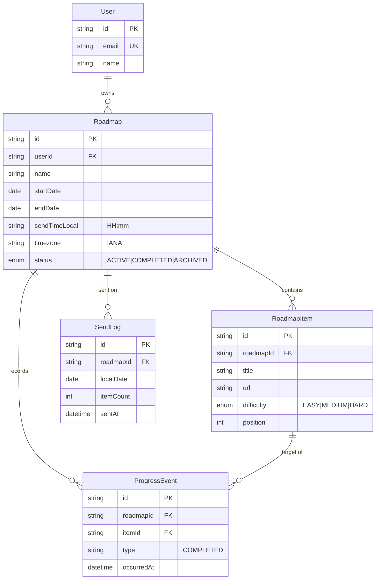
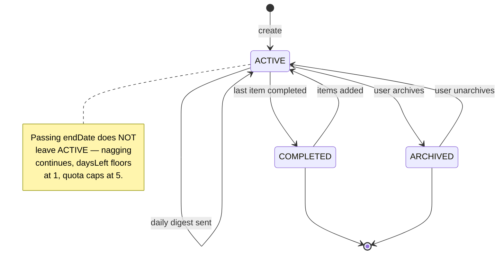
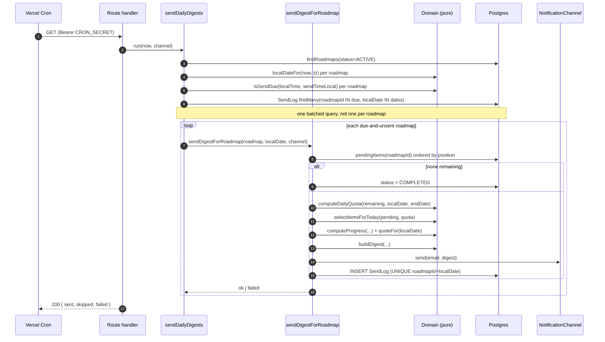

# Architecture

This document describes how LockedIn is put together, and — more importantly — *why the pieces are
separated where they are*. The MVP scope is defined in [ROADMAP.md](./ROADMAP.md); the technology
choices and their rationale are in [DECISIONS.md](./DECISIONS.md). This document sits between the
two: given those features and that stack, this is the shape of the code.

Read this before adding a module. The layer boundaries here are load-bearing — two of them exist to
satisfy explicit constraints from `ROADMAP.md`, and one of them (the pure domain) is what makes the
project testable at all. Where a rule can be mechanically enforced, it is; see §8.

---

## 1. System context



One deployable: the Next.js app. There is no separate backend service and no worker fleet — per
ADR-001 and ADR-007 the app *is* the backend.

The scheduler is deliberately *not* part of the app. Whatever wakes the sweep does so with one
authenticated HTTP call and holds no logic of its own, which is why the box above contains two
schedulers at once and why replacing them is configuration rather than code (§10).

The sweep polls rather than firing per-user. Consequences of that are handled in §5, and the point at
which it stops working is quantified in §6.

---

## 2. Layers



### The domain layer is pure

`src/domain/` contains no `import` of Prisma, no `fetch`, and **no `Date.now()` or `new Date()`**.
Every input, including the current instant, is a parameter.

This is the single most important rule in the codebase. It means the entire pacing engine — how many
problems you get today, which ones, how far along you are, whether an email is due — is testable
with no database, no network, no clock mocking, and no fixtures. A test for "a user who ignored the
email for four days gets two problems on day six" is three lines and runs in a millisecond.

**The rule includes type-only imports.** `import type { RoadmapItem } from '@prisma/client'` adds no
runtime I/O, so it would never show up in a test, but it silently couples the domain to the database
schema and defeats the point. `src/data/` repositories are solely responsible for mapping Prisma rows
into the plain types declared in `src/domain/types.ts` before anything reaches a domain function.
This is enforced by lint (§8), not just by convention.

`DailyDigest` and `DigestItem` therefore live in `src/domain/types.ts`, not alongside the channel
interface — `buildDigest` produces them, and the domain cannot import from an outer layer to get its
own return type. `notifications/channel.ts` imports them inward, which is the direction the arrows
already go.

Anything that needs the real clock or the real database lives in `src/usecases/`, which is thin by
design: it fetches, calls domain functions, and writes back.

### Seam: notifications

`ROADMAP.md` requires that "the code that decides *what* to send and *when* should not be entangled
with the code that decides *how*". That seam is `NotificationChannel`:

```ts
export interface NotificationChannel {
  send(to: string, digest: DailyDigest): Promise<void>;
}
```

`EmailChannel` implements it over Resend. `FakeChannel` implements it by recording calls in an array,
which is what every cron test asserts against — **no test ever touches Resend**.

`FakeChannel` can also be told to fail for a given recipient. That matters: `send` returns a promise
that can reject, and the sweep is required to survive one roadmap's send failing (§5). Without an
injectable failure mode the fake could only model the happy path, and a second ad-hoc double would
get invented later — breaking the "one fake, tested against the same contract" guarantee.

One honest caveat about how far this seam gets us. Adding WhatsApp or push is *not* purely "write a
new implementation and change nothing else": the sweep currently receives one channel for the whole
run, so per-user channel preference will need a preference field and a change in the orchestrator
from "take a channel" to "resolve a channel per roadmap". The seam means the domain and the digest
logic don't move. It does not mean the change is free.

### Seam: roadmap sources

`ROADMAP.md` requires that "upload questions" not be wired so tightly into the roadmap model that
"AI generates the list instead" needs a schema rewrite. That seam is `RoadmapSource`:

```ts
export interface RoadmapSource {
  read(input: string): Promise<ParsedItem[]>;
}
```

`CsvUploadSource` is the only implementation in the MVP, and its body is synchronous — `parseCsv` is
a pure domain function. The interface is **async anyway, deliberately**. A future AI-generation source
calls an LLM over the network; if the interface were declared sync because that is all CSV needs
today, adding it later would change the interface, both implementations, and every call site. Async
now costs one `Promise` wrapper and removes that future churn.

---

## 3. Data model



Four things worth stating explicitly:

**`RoadmapItem` is deliberately generic.** Title, url, difficulty, position — no `leetcodeSlug`, no
`problemNumber`, nothing LeetCode-specific. `ROADMAP.md` requires this shape so a future
AI-generation path or a non-LeetCode habit populates the same table. `url` stays `NOT NULL` for the
MVP because the daily email is required to contain a link; generalising to link-less habits later is
a non-destructive `DROP NOT NULL`.

**There is no schedule table.** No item is ever assigned to a date. The daily quota is recomputed
from current state on every send (§4). This is what makes `startDate`, `endDate`, and the item list
freely editable at any time — change the end date and tomorrow's email simply reflects it. Persisting
a schedule would mean invalidating and rebuilding it on every edit.

**`ProgressEvent` is append-only.** Completion is not a boolean on the item; it is
`COUNT(DISTINCT itemId) WHERE type = 'COMPLETED'`. `ROADMAP.md` requires progress be extensible
enough that a future XP/level/mission layer can be computed from it "without needing to re-derive
history retroactively", so the timeline is kept from day one. `UNIQUE(itemId, type)` makes marking
an item complete twice a no-op rather than a double count.

**`SendLog` exists for idempotency, and doubles as an audit trail.** See §5. `itemCount` is worth the
column despite nothing reading it in normal operation: the quota is recomputed on every send and
never persisted, so `itemCount` is the *only* historical record of what the pacing engine actually
decided on a given day. Without it, "why did I get five problems on Tuesday?" is unanswerable.

### Indexes

Postgres does not index foreign keys automatically. Beyond the two unique constraints, the query
patterns in §5 and the ownership checks in §7 require:

| Index | Serves |
|---|---|
| `Roadmap(status)` | the cron sweep's `findRoadmaps(status = ACTIVE)` |
| `Roadmap(userId)` | "list my roadmaps" and every ownership check |
| `RoadmapItem(roadmapId, position)` | `pendingItems` ordered by position, without a per-call sort |
| `ProgressEvent(roadmapId, type)` | `computeProgress`'s count; the `(itemId, type)` unique index does not serve it |
| `SendLog(roadmapId, localDate)` UNIQUE | idempotency, and the batched already-sent lookup |
| `ProgressEvent(itemId, type)` UNIQUE | makes double-marking a no-op |

These are correctness, not scaling machinery — an unindexed `Roadmap.userId` means a sequential scan
on the hottest query in the app.

### Roadmap lifecycle



`endDate` is a goal, not a wall. A roadmap whose end date has passed keeps sending, because the
product's stated purpose is to nag "until they finish it". The consequence is that a roadmap never
dies on its own, which is why archiving exists — as a `status` value on the existing resource, not as
a bespoke endpoint (§7).

`ROADMAP.md` feature 7 is one-directional: "mark a problem as solved". Un-marking is therefore **out
of MVP scope**. The append-only progress log means adding it later is a `DELETE` on the completion
subresource with no schema change — which is the payoff for keeping history rather than a column.

---

## 4. The pacing rule

Rate-based, recomputed at send time, nothing persisted.

```ts
// src/domain/quota.ts — pure
export const DAILY_CAP = 5;

export function computeDailyQuota(input: {
  remainingCount: number;
  today: LocalDate;
  endDate: LocalDate;
}): number {
  const { remainingCount, today, endDate } = input;
  if (remainingCount <= 0) return 0;
  const daysLeft = Math.max(1, daysInclusive(today, endDate)); // floors at 1 past endDate
  return Math.min(DAILY_CAP, Math.max(1, Math.ceil(remainingCount / daysLeft)));
}
```

`DAILY_CAP` is referenced directly rather than passed as a parameter. Nothing in the schema lets a
roadmap configure its own cap, so an overridable argument would be a knob with no caller.

`startDate` is intentionally **not** an input here. It governs two other things: suppressing sends
before the roadmap begins, and the "days elapsed / total" half of the progress display.

Worked example — 30 items, Jan 1 → Jan 30, user ignores Jan 2–5:

| Date | remaining | daysLeft | raw | sent |
|---|---|---|---|---|
| Jan 1 | 30 | 30 | 1.00 | 1 |
| Jan 6 | 30 | 25 | 1.20 | 2 |
| Jan 7 | 28 | 24 | 1.17 | 2 |
| Jan 28 | 8 | 3 | 2.67 | 3 |
| Jan 30 | 6 | 1 | 6.00 | **5** (capped) |
| Feb 2 | 6 | 1 (floored) | 6.00 | **5** (still nagging) |

Falling behind raises the daily load gradually rather than presenting a punishing catch-up bill, and
the deficit is amortised over the whole remaining period. The cap of 5 exists because a 20-problem
email is noise, not a nudge.

Because the quota can exceed 1, **the daily email carries a list of problems, not a single problem.**

---

## 5. The daily send flow

Two functions, because there are two reasons to change. `sendDailyDigests` owns the sweep: fetch,
loop, isolate per-roadmap failures, aggregate a result. `sendDigestForRoadmap` owns one roadmap's
decision pipeline. The requirement that one roadmap's send failure must not abort the sweep is what
forces the split — the `try`/`catch` belongs around the pipeline, not inside it.



### Why idempotency is a schema constraint, not a code check

The cron runs every 15 minutes, so a naive "is it past send time?" check would mail the same user
96 times a day. `SendLog` has `UNIQUE(roadmapId, localDate)`, and a row is written after each
successful send. The uniqueness is enforced by Postgres rather than by an `if` statement because
two overlapping cron invocations would both pass the `if`.

Duplicate daily emails are the most likely way this product embarrasses itself in front of a real
user, so the guarantee lives in the database.

### The claim is taken before the send, and released if it fails

`recordSend` runs *before* `channel.send`, not after. Claiming afterwards would let
two overlapping invocations both pass their checks and both deliver, which is the
failure this table exists to prevent. Claiming first means only one wins the
insert.

The cost of that ordering is that a failed send must give the day back, or a
transient Resend outage would cost the user the whole day rather than one retry.
`releaseSend` does that, and there is a test asserting no claim is left behind and
the next sweep delivers.

Releasing on failure reopens a subtler hole, which is why the send carries an
**idempotency key**. `channel.send` rejecting does not prove nothing was
delivered: a timeout or a connection reset *after* Resend accepted the message
throws on our side while the email is already on its way. Release the claim and
the next tick sends a second, genuine email — the exact failure this table exists
to prevent, arriving by a different route. Every send therefore carries
`sentKey(roadmapId, localDate)` as its `Idempotency-Key`, so a retry of an
ambiguous failure is collapsed by the provider rather than delivered twice.
Distinguishing ambiguous from clean failures in application code would be
guesswork; letting the provider dedupe is not.

**Residual risk, stated honestly:** if the process dies in the window between the
claim being written and the send completing, the claim survives and no email was
sent — that user silently loses that day. It is bounded to one day: tomorrow is a
new `localDate`. The window is small, the consequence is one missed nudge, and the
alternative ordering trades it for duplicate emails under concurrency, which is
worse and much more visible. If this ever needs closing, the fix is a
`sentAt`-null claim row that a later tick can reap, not a change of ordering.

### Why due-ness is self-healing

Due-ness is `localTime >= sendTimeLocal AND no SendLog for today`, not "are we inside a 15-minute
window around send time". If a cron run is missed, fails, or Vercel is briefly down, the next run
that day still delivers. There is no catch-up queue and no retry state, because the condition is a
function of current state rather than of having observed a particular moment.

The cost of that design is that a roadmap stays "past its send time" for the rest of the local day,
so the already-sent check runs against every such roadmap on every tick — 96 times a day, not once.
That is why the check is **one batched query** over all due roadmaps rather than a point lookup per
roadmap. Sequential point queries here would be the first thing to break under load (§6).

### Timezones

`sendTimeLocal` is meaningless without a timezone, so `Roadmap.timezone` holds an IANA zone and every
comparison happens in the roadmap's local time. `localDateFor(instant, tz)` is a pure function, so
"a Kolkata roadmap and a New York roadmap fire at different UTC instants" is an ordinary unit test.

The `localDate` stored on `SendLog` is the *roadmap's* local date. That matters: it is what makes
"once per day" mean once per the user's day, not once per UTC day.

---

## 6. Known limits and their triggers

Nothing here is built yet. It is recorded so the next person knows what to watch and does not build
it early.

**Reason about `S`, not `N`.** Batching the already-sent lookup (§5) made the
per-roadmap cost of an *already-sent* roadmap zero, which moved the bottleneck off
total active roadmaps (`N`) and onto the number **due-and-unsent in a single
15-minute window** (`S`). Those are very different numbers, because users cluster
around 07:00–09:00. Headroom estimates phrased in terms of `N` are stale by
construction.

| Limit | Bites at roughly | Response |
|---|---|---|
| Sequential per-roadmap already-sent queries | — | **Already addressed** — batched into one `findMany` (§5) |
| Sequential email sends within a tick | `S ≈ 100–150` on a default duration budget | Bounded concurrency via `Promise.allSettled` in small batches, still inside the same function. No queue |
| The whole poll-and-loop shape | `S` past the concurrency fix, or a second channel needing its own retry semantics | Migrate to Inngest per ADR-006 |

Each due-and-unsent roadmap costs roughly two reads, one write and one provider
call — order of 300ms–1.5s. `S ≈ 100–150` is where sequential processing starts to
strain a default serverless duration budget, and with realistic send-time
clustering that can arrive at a **total** of only a few hundred to ~1,000 active
roadmaps.

The documented trigger for adding concurrency is deliberately much earlier —
**~25 due-and-unsent in one window** — so there is a 4–6× margin before the real
cliff. Do not pre-empt it, and do not measure the wrong thing: instrument the
due-and-unsent count per tick, not the roadmap table's row count.

When that work happens, collapse `listOutstandingItems` + `countItems` in
`sendDigestForRoadmap` at the same time — they answer different questions today at
the cost of two round trips, and both counts can be derived in memory from one
fetch. Not worth a separate visit.

---

## 7. API conventions

Defined once, here, so six route handlers don't each invent a shape.

The machine-readable form of this section is an OpenAPI 3.1 document at
`/api/openapi.json`, rendered by Swagger UI at `/api-docs`. It is built in
`src/http/openapi.ts` and is deliberately not a second source of truth: request
bodies are `z.toJSONSchema` of the schemas `parseBody` actually runs, response
bodies are declared `satisfies ZodType<T>` against the domain types the handlers
return, and `tests/unit/http/openapi.test.ts` walks `app/api` and fails on a route
with no entry. What follows is the reasoning; the document is the reference.

| Endpoint | Verb | Success |
|---|---|---|
| `/api/roadmaps` | `POST` | `201` + the created roadmap |
| `/api/roadmaps` | `GET` | `200` + `Roadmap[]`, the caller's own |
| `/api/roadmaps/:id` | `GET` | `200` + one `Roadmap` |
| `/api/roadmaps/:id` | `PATCH` | `200` + the updated `Roadmap` |
| `/api/roadmaps/:id/items` | `POST` | `201` + the created items, in full |
| `/api/roadmaps/:id/items` | `GET` | `200` + `Array<RoadmapItem & { completed: boolean }>` |
| `/api/roadmaps/:id/items/:itemId/completion` | `PUT` | `204` |
| `/api/roadmaps/:id/progress` | `GET` | `200` + `Progress`, i.e. `{ completedCount, totalCount, daysElapsed, totalDays }` |
| `/api/cron/send-daily` | `GET` | `200` + `{ sent, skipped, failed }` |

`GET /api/roadmaps/:id/items` exists because it is otherwise impossible to render
the roadmap detail screen on a page load: `GET .../progress` returns only
aggregate counts, so without it the per-item list would be visible exactly once,
in the response to the upload that created it. The derived `completed` flag lives
on the response rather than on `RoadmapItem`, because completion is an event and
the domain type stays a description of the item itself.

Create responses carry the full object rather than an id, uniformly. The client
needs the fields to render, and one shape across all creates is one fewer thing
to remember.

**Completion is a subresource, not an action.** `PUT .../completion` rather than `POST .../complete`,
because the operation is required to be idempotent and `PUT` is idempotent by definition rather than
by informal promise. It also leaves the obvious slot for `DELETE .../completion` when un-marking
comes in scope (§3).

**Archiving is a field, not an endpoint.** `status` is already a column and `PATCH /api/roadmaps/:id`
already exists for the roadmap's other mutable fields, so archive and unarchive are
`PATCH { status: "ARCHIVED" | "ACTIVE" }`. `COMPLETED` is server-derived and rejected as an input.
This removes an endpoint instead of adding one.

**Not-found and not-owned both return `404`.** Never `403`. A `403` on someone else's roadmap
confirms the id exists, which turns the API into an id oracle. It is also less code: one
`WHERE id = ? AND userId = ?` naturally yields null, whereas distinguishing the two cases needs a
second unfiltered query.

**Ownership is checked at every level, not just the top one.** `PUT
.../items/:itemId/completion` must confirm the *item* is in the roadmap, not only
that the roadmap belongs to the caller. `markItemComplete` enforces this and
returns `false` on mismatch, which the handler turns into a `404`. Skipping it is
not merely an access-control hole: `ProgressEvent` carries `roadmapId`
denormalised so the completed-count query avoids a join, so a mis-scoped pair
would inflate the progress of a roadmap that never contained the item.

**Status codes.** `401` unauthenticated. `404` missing or not-owned. `400` malformed JSON. `422`
syntactically valid but failing a business rule — bad `HH:mm`, `endDate` before `startDate`, unknown
IANA zone, bad CSV rows. `204` for a successful mutation with nothing to return.

**Error codes are a fixed set**, so six handlers do not invent six spellings of
"not found":

| `code` | Paired with |
|---|---|
| `UNAUTHENTICATED` | `401` |
| `NOT_FOUND` | `404` — missing or not-owned, indistinguishable by design |
| `MALFORMED_JSON` | `400` |
| `VALIDATION_FAILED` | `422`, with `details` |

**Request bodies are validated at the boundary, at runtime.** `RoadmapPatch.status`
is typed to exclude `COMPLETED`, but a TypeScript type is no defence against
untrusted JSON — `await request.json()` cast to the patch type would let
`{"status":"COMPLETED"}` straight through. Every handler parses its body with a
Zod schema before the value is treated as a domain input.

**One error envelope.**

```json
{
  "error": {
    "code": "VALIDATION_FAILED",
    "message": "2 rows could not be parsed",
    "details": [
      { "path": "row.3", "message": "difficulty must be EASY, MEDIUM or HARD" },
      { "path": "row.7", "message": "url is required" }
    ]
  }
}
```

`details` is optional and always an array, which lets per-row CSV errors and multi-field validation
errors share one shape. A CSV upload with any invalid row is rejected whole — no partial imports.

**The cron endpoint mutates on `GET`**, which violates GET-safety. Vercel Cron only issues `GET`, so
there is no alternative verb available (ADR-006/007). The Bearer secret controls who can trigger it,
and the handler declares `export const dynamic = 'force-dynamic'` so a cached `200` can never be
served in place of actually running the sweep.

**Partial failure is `200`; total failure is `503`.** The sweep is designed to
survive one roadmap failing, so the request itself succeeded and per-roadmap detail
belongs in the body. But a tick where every attempt failed — a revoked API key —
must not look healthy, because Vercel's cron monitoring keys off HTTP status, and
otherwise a systemic outage is invisible until a user notices no mail arrived. An
idle tick has nothing to fail and stays `200`.

**There is no separate dev-only send endpoint.** One existed, guarded only by
`NODE_ENV`. That guard was correct solely because Vercel forces
`NODE_ENV=production` on deployed builds — a platform fact the file never asserted.
Once it carried the same `CRON_SECRET` as the cron route it *was* the cron route,
so it was deleted rather than duplicated. Local triggering calls the cron endpoint
with its secret; the harness UI has a session-authenticated action instead.

---

## 8. Enforced rules

Three rules are mechanically checked, because each is the kind that rots silently and none of them
would otherwise fail a test:

| Rule | Enforced by |
|---|---|
| `src/styles/tokens.css` is the only file with a hex colour literal | `pnpm lint:tokens` (grep) |
| `src/domain/**` imports no Prisma (including `import type`), no outer layer, no framework, no vendor SDK | `eslint.config.mjs` — `no-restricted-imports`, scoped to `src/domain/**` |
| `src/domain/**` contains no `new Date()` / `Date.now()` | `eslint.config.mjs` — `no-restricted-syntax` |
| `app/**` does not import `src/data/**` directly | `eslint.config.mjs` — `no-restricted-imports`, scoped to `app/**` |
| Every route handler under `app/api`, and every verb it exports, appears in the OpenAPI document | `tests/unit/http/openapi.test.ts` — walks the directory |

A type-only Prisma import in the domain adds no runtime I/O, so no test would catch it — but it
couples the domain to the schema and defeats the layer. Hence lint, not review.

---

## 9. Repository layout

```
docs/                         ROADMAP, DECISIONS (ADRs), ARCHITECTURE
prisma/schema.prisma
scripts/check-tokens.sh
src/
  domain/                     PURE — no I/O, no clock, no Prisma
    dates.ts                  LocalDate, daysInclusive, localDateFor, isSendDue
    quota.ts                  computeDailyQuota
    selection.ts              selectItemsForToday
    progress.ts               computeProgress
    csv.ts                    parseCsv
    digest.ts                 buildDigest + the quote table
    types.ts                  DailyDigest, DigestItem, ParsedItem, LocalDate
  data/                       Prisma repositories; map rows -> domain types
  notifications/
    channel.ts                NotificationChannel interface
    email-channel.ts          Resend implementation
    fake-channel.ts           in-memory + injectable failure, tests only
  sources/
    source.ts                 RoadmapSource interface (async)
    csv-source.ts             CsvUploadSource
  usecases/                   orchestration — the only place with clock + DB
    send-daily-digests.ts     sendDailyDigests + sendDigestForRoadmap
    roadmaps.ts
    progress.ts
  emails/DailyDigest.tsx      React Email template
  styles/tokens.css           the ONLY file with hex literals
  auth.ts                     Better Auth config
app/
  api/auth/[...all]/route.ts
  api/roadmaps/...
  api/cron/send-daily/route.ts
  (app)/                      roadmaps, roadmaps/[id] — and a dev-only
                              session-authenticated "run sweep" action
  (auth)/                     sign-in, sign-up
  (app)/                      roadmaps, roadmaps/new, roadmaps/[id]
tests/
  unit/                       domain — no DB, no network
  integration/                repositories, API, cron — real Postgres
  helpers/                    resetDb, signUpAndSession, makeRoadmap
```

`isSendDue` lives in `dates.ts` and the quote table in `digest.ts` rather than in files of their own —
each is a handful of lines with exactly one consumer, and a file per function is boilerplate at that
size.

### Test strategy

Two Vitest projects, because the split is meaningful:

- **`unit`** — everything in `src/domain/`. No database, no network, no clock. If a unit test needs
  any of those, the code under test is in the wrong layer.
- **`integration`** — repositories, API route handlers, and the cron orchestrator, against a real
  Postgres (Docker locally, a Neon branch in CI). Runs single-fork and serialised: these tests share
  one database and truncate between files. The cron tests use `FakeChannel`, so they exercise the
  real database and the real domain logic while asserting on captured payloads.

The frontend has no tests. It is a harness for driving the API by hand, and will be replaced.

---

## 10. Triggering the sweep

The contract is one sentence: **an HTTP `GET` to `/api/cron/send-daily` carrying
`Authorization: Bearer $CRON_SECRET`.** Nothing else. The caller passes no
parameters, makes no decisions, and needs no knowledge of roadmaps, timezones or
send times — all of that is inside the app.

That is what makes the scheduler swappable without touching application code, and
it is worth protecting. Two properties do the protecting:

- **Idempotent per roadmap-day.** `UNIQUE(roadmapId, localDate)` on `SendLog`
  means calling this endpoint twice, or a hundred times, sends at most one email
  per roadmap per local day. So you can point *several* schedulers at it
  simultaneously and they cannot fight.
- **Self-healing.** Due-ness is "has the send time passed and have we not sent
  today", never "did you fire at exactly 07:00". A late or missed call costs
  nothing as long as some later call lands the same day.

Together those mean a scheduler needs no retry logic, no state, and no
coordination with any other scheduler.

### What currently calls it

| Caller | Cadence | Why |
|---|---|---|
| `.github/workflows/send-daily.yml` | every 15 min | The real driver. Free, and Vercel's Hobby plan cannot go below daily (ADR-014) |
| `vercel.json` `crons` | daily, ~01:00 UTC | Backstop. If Actions is broken or disabled, users still get nagged once a day |
| Harness UI "Run sweep" | manual, dev only | Session-authenticated, absent in production |

### Swapping it

- **To Vercel Cron only** (needs Pro): set `vercel.json` to `*/15 * * * *` and
  delete the workflow. No code change.
- **To Inngest** (ADR-006): Inngest calls the same endpoint, or invokes
  `sendDailyDigests` directly since it is a plain exported function taking `now`
  and a channel. No code change to reach it either way.
- **To anything else** — cron-job.org, QStash, a VPS crontab: it is a `curl` with
  a header.

The one thing not to do is move the *deciding* into the scheduler. The moment a
caller starts computing who is due, the contract above is gone and every scheduler
becomes a rewrite.
